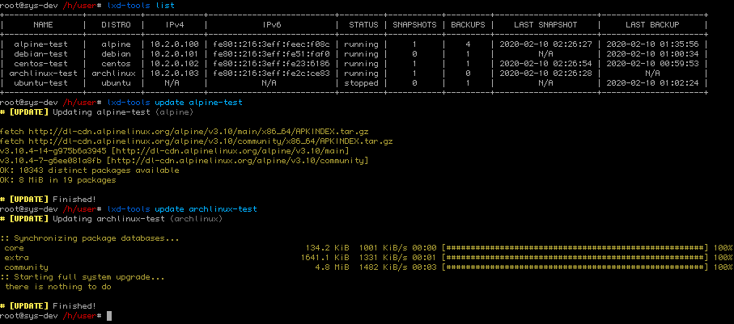
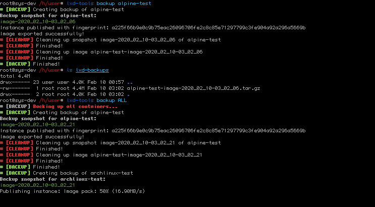
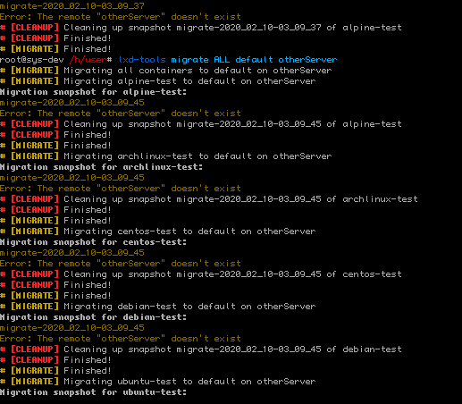
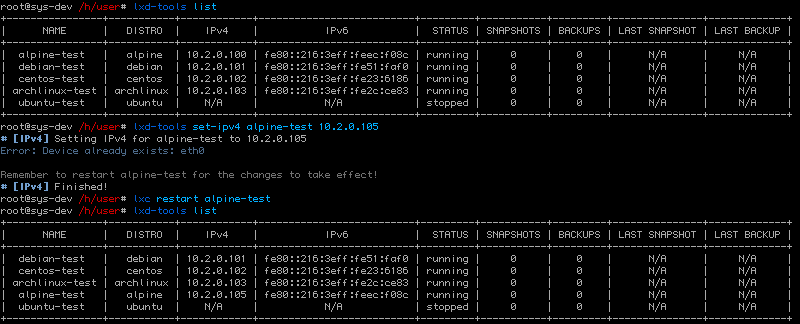

# lxd-tools
## LXD Powertool

Capable of updating, snapshotting, backing up and migrating containers individually or en-masse.

Can also mass clean existing snapshots and backups (assuming they have the container's name in their filename) for one container or all containers.

Useful for automation.

*Tested on LXD 3.20 running in Snap on Fedora 30*

---

**Capable of updating containers running:**

* Ubuntu, Debian, Devuan, Kali, Linux Mint
* Alpine Linux
* CentOS, Fedora
* Arch Linux

Want to add your own? See: `distroCommand`

---

### CONFIGURATION OPTIONS:

*Modify the script to change these if required.*

    runCommands = 1
    debug = 0
    lxcPath = `which lxc` or "/var/lib/snapd/snap/bin/lxc"
    lxdBridge = "lxdbr0"
    backupFolder = CURRENT WORKING DIRECTORY + "/lxd-backups/"
    sortListBy = "ipv4"
    sortListReverse = False


### PARAMETERS:
```
help
list [backups/snapshots]
update <container-name/ALL>
snapshot <container-name/ALL>
backup <container-name/ALL>
migrate <container-name/ALL> <storage-pool> <remote-name>
cleanup <snapshots/backups> <container-name/ALL>
set-ipv4 <container-name> <ipv4>
```

### DISCLAIMER
    Could horribly break everything!
    
    I take no responsibility over the use of this random unofficial LXD helper script you found on the Internet.

    Use with runCommands = 0 and debug = 1 if you want a list of commands generated by this script instead of actually running them.

### REQUIREMENTS:
* python3.x
* PrettyTable

```bash
sudo pip3 install PrettyTable
```


### RUNNING:
```bash
chmod +x lxd-tools
./lxd-tools <parameters>
```


### INSTALLING TO SYSTEM:
(OPTIONAL)
```bash
sudo pip3 install PrettyTable
git clone https://github.com/unendingPattern/lxd-tools.git
sudo cp -f lxd-tools/lxd-tools /usr/local/bin
sudo chmod +x /usr/local/bin/lxd-tools
lxd-tools <parameters>
```
OR
```bash
sudo pip3 install PrettyTable
sudo wget -O /usr/local/bin/lxd-tools https://github.com/unendingPattern/lxd-tools/raw/master/lxd-tools
sudo chmod +x /usr/local/bin/lxd-tools
lxd-tools <parameters>
```


### USING WITH CRONTAB:
Backup all containers at midnight:
```bash
0 0 * * * path/to/lxd-tools backup ALL
```
Backup a specific container at 04:05 AM:
```bash
5 4 * * * path/to/lxd-tools backup specific-container
```


### SCREENSHOTS:

<a href="screenshots/1.png" target="_blank"></a>  <a href="screenshots/2.png" target="_blank"></a>  <a href="screenshots/3.png" target="_blank"></a>  <a href="screenshots/4.png" target="_blank"></a>  <a href="screenshots/5.png" target="_blank"></a>  <a href="screenshots/6.png" target="_blank"></a>  <a href="screenshots/7.png" target="_blank"></a>  <a href="screenshots/8.png" target="_blank"></a>
